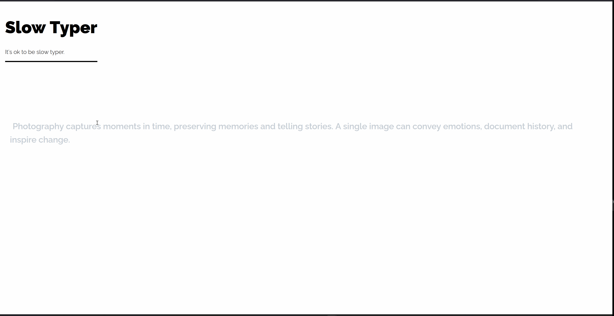

# Slow Typer

A minimalist typing speed test application built with React and TypeScript. Because it's okay to be a slow typer! 🐌⌨️



## Features

- **Random Text Generation**: Practice with a variety of texts from different categories
- **Real-time Feedback**: Visual indicators for correct, incorrect, and current character positions
- **Performance Metrics**: Track your Words Per Minute (WPM), accuracy, and mistakes
- **Timer**: Automatic timing from the moment you start typing
- **Clean Interface**: Distraction-free design focused on the typing experience
- **Responsive Design**: Works seamlessly across different screen sizes

## Demo

The application provides:
- Visual feedback with color-coded characters (correct, incorrect, current position)
- Real-time statistics calculation
- Smooth typing experience with cursor animation
- Reset functionality to start a new test

## Tech Stack

- **React 19** - UI framework
- **TypeScript** - Type safety and better development experience
- **Vite** - Fast build tool and development server
- **CSS3** - Custom styling with animations
- **ESLint** - Code linting and quality assurance

## Installation

1. **Clone the repository**
   ```bash
   git clone https://github.com/yourusername/slow-typer.git
   cd slow-typer
   ```

2. **Install dependencies**
   ```bash
   npm install
   ```

3. **Start the development server**
   ```bash
   npm run dev
   ```

4. **Open your browser** and navigate to `http://localhost:5173`

## Scripts

- `npm run dev` - Start development server
- `npm run build` - Build for production
- `npm run preview` - Preview production build
- `npm run lint` - Run ESLint

## Project Structure

```
src/
├── components/
│   ├── TextDisplay.tsx     # Main typing interface
│   ├── Stats.tsx          # Performance statistics display
│   └── InputField.tsx     # (Placeholder component)
├── hooks/
│   └── usetypingTest.tsx  # Custom hook for typing logic
├── styles/
│   ├── TextDisplay.css    # Styling for text display
│   └── State.css         # Styling for statistics
├── assets/
│   ├── text.json         # Collection of practice texts
│   └── resetIcon.svg     # Reset button icon
├── types/
│   └── index.ts          # TypeScript type definitions
├── App.tsx               # Main application component
├── App.css              # Global application styles
└── main.tsx             # Application entry point
```

## How It Works

### Core Functionality

1. **Text Selection**: Random texts are selected from a curated collection in `text.json`
2. **Input Handling**: Keyboard events are captured globally to provide seamless typing experience
3. **Character Tracking**: Each character is compared in real-time with color-coded feedback:
   - Gray: Untyped characters
   - Black: Correctly typed characters
   - Red: Incorrectly typed characters
   - Blinking cursor: Current position

### Performance Metrics

- **WPM (Words Per Minute)**: Calculated as `(characters typed / 5) / minutes`
- **Accuracy**: Percentage of correctly typed characters
- **Mistakes**: Total number of incorrect characters
- **Time**: Precise timing from first keystroke to completion

### Key Features

- **Prevent overtyping**: Users cannot type beyond the text length
- **Real-time updates**: Statistics update as you type
- **Error tracking**: Comprehensive mistake counting
- **Smooth animations**: CSS animations for cursor and transitions

## Customization

### Adding New Texts

Edit `src/assets/text.json` to add new practice texts:

```json
[
  "Your custom text here...",
  "Another practice text..."
]
```

### Styling

The application uses modular CSS files:
- `App.css` - Global layout and header styles
- `TextDisplay.css` - Character styling and animations
- `State.css` - Statistics display styling

### Configuration

Key customizable elements:
- Text selection algorithm in `App.tsx`
- Timer precision in `usetypingTest.tsx` (currently 100ms intervals)
- Character styling in `Tex